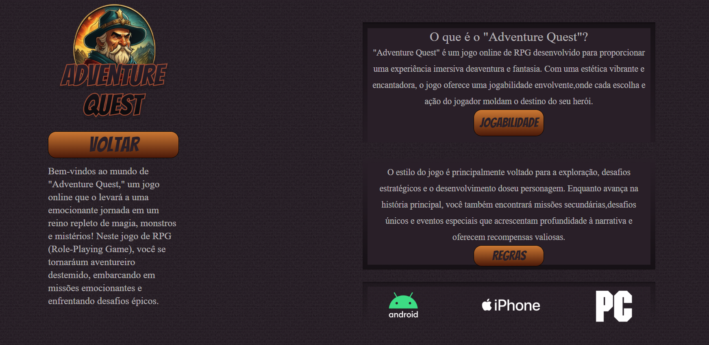

# Adventure Quest

Bem-vindo ao Adventure Quest, um projeto de jogo RPG que traz interface visualmente deslumbrantes.

Esse projeto foi impulsionado por fins educacionais proposto pela [Inara Almeida](https://www.linkedin.com/in/inaralmeida/), ele oferece uma visão de como a combinação de tecnologia e criatividade pode resultar em algo único e ilustra a capacidade de superar obstáculos e evoluir por meio da dedicação ao aprendizado e à aplicação prática.

## Tecnologias Utilizadas :
O Adventure Quest foi criado com dedicação, aplicando conhecimentos de HTML e CSS. Durante o desenvolvimento foquei na aplicação correta das tags HTML de forma semântica, proporcionando uma base sólida para a estrutura do jogo. Além disso, o uso adequado de flexbox permitiu a criação de layouts flexiveis e responsivos.

## Recursos Destacados :
Utilização Exemplar do Flexbox: Aproveite o layout responsivo e adaptável, garantindo que o Adventure Quest seja acessível em diversas plataformas.

Aprendizado Substancial de HTML e CSS: Testemunhe a aplicação de boas práticas de desenvolvimento, incluindo o uso semântico de tags HTML e o aproveitamento eficaz do CSS.

## Uso do projeto :
1- Faça o download do projeto Adventure Quest ou clone o repositório para o seu computador  
2- Abra o arquivo 'index.html' em seu navegador  
3- Explore um mundo incrível e embarque em uma jornada épica no papel de um herói destemido(mesmo que seja apenas por meio da experiência visual proporcionada pelo HTML e CSS).

## Autor
- Linkedin - [Jessica Hatsumi Isibasi](https://www.linkedin.com/in/jessica-isibasi-728731245/) 